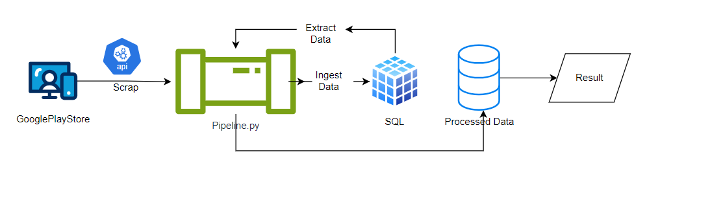

# MobileBankingUXReport
Turning user feedback into actionable UX improvements for mobile banking.
A well-designed and user-friendly app can positively impact the overall brand perception and credibility. 
By identifying and addressing UX weaknesses, a mobile app can stand out from competitors and attract a larger user base. 

1. Create own python env
2. pip install -r requirements.txt
3. 

